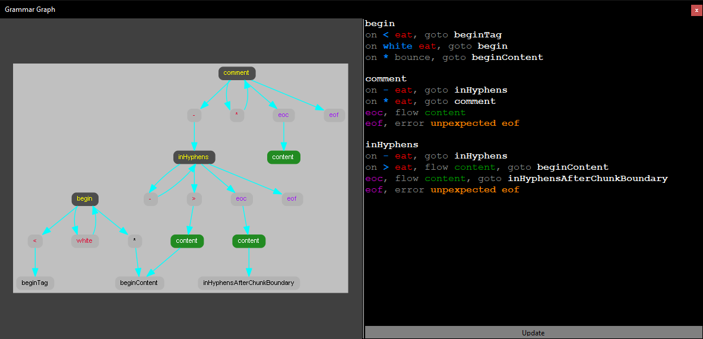

# Grammar Graphing


This is a small tool a wrote for myself to let me diagram language grammars using a textual notation.   
  
Features a simple syntax entered as text, with syntax highlighting to improve readability, and generated into a graph using GraphViz.  
  
*Note:* text content is automatically saved on Update and exiting the program, and re-loaded on startup.

## Requirements
GraphViz installed. "Dot.exe" should be added to the path.

## Syntax

**State**  
a state is added as a line containing a single word (ascii without whitespace)  

**Transitions**  
a transition from one state to another can be added with any of three triggers.  
A trigger always begins on a line.  
All transitions from a given state must be added in a block after that state.   
  
The available triggers are:
* eof : end of file. has no parameters.
* eoc : end of chunk (when handling streaming inputs). has no parameters
* on : when looking at the input stream and determining an action. has the following parameters:
  * characters : which character(s) trigger the transtion
  * consumption : what happens to the character(s) that were read. can be either of:
    * eat: character is discarded
    * bounce: character is replayed into the next state after transition
   
**Actions**  
as a result of a transition things should happen, these are added as a comma separated list after the trigger.  
Available actions are:
* flow : send something (e.g. a token) to the next phase of parsing. has one parameter
  * content : a single word describing what is flowed
* error : enter an error condition. should terminate the line. has a single parameter
  * description : free form text that should not contain a comma or a newline
* goto : transition to another state. has a single parameter
  * target : a single word that is the name of the state to transition to

**example**
```
StateA
on newline eat, goto StateB
eof, error unexpected end of file
eoc, goto StateC

StateB
on any bounce, goto StateC
eof, goto StateC
eoc, goto StateC

StateC
on any eat, flow madeIt, goto END
eof, goto END
eoc, goto StateC
```

## Notes
Implemented using WinForms, C# Core  
Syntax highlighting is done using the RichTextBox.  
Graph is generated using dot.exe  
Temporary .gv and .png files are written to the users temp folder **but** are not normally cleaned up - manual task!
Copy/Paste any text images that need preserving.

## Todo (long term)
A few things that could be added, but I've no plans to do so for now.
* Save/Load
* Tooltips to explain error conditions

Feel free to use / repurpose this as needed.

License: [MIT](https://choosealicense.com/licenses/mit/)